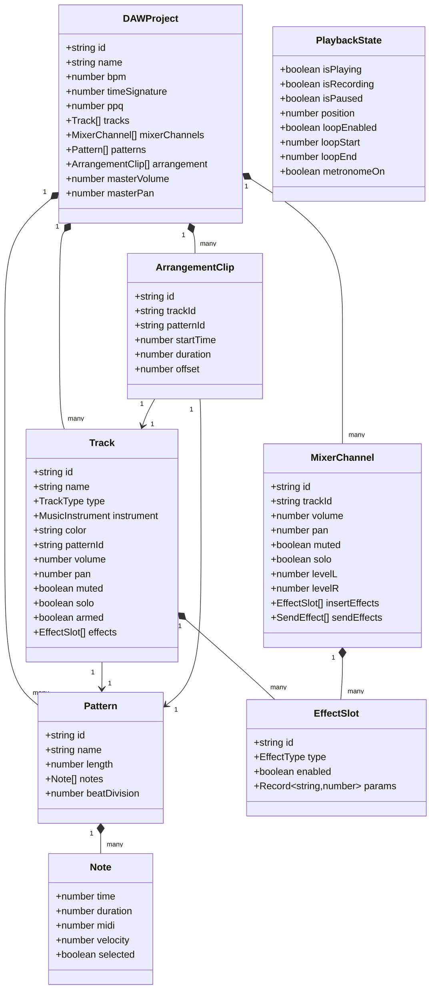
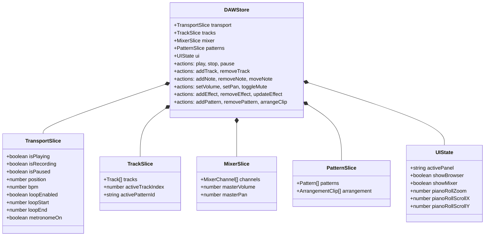
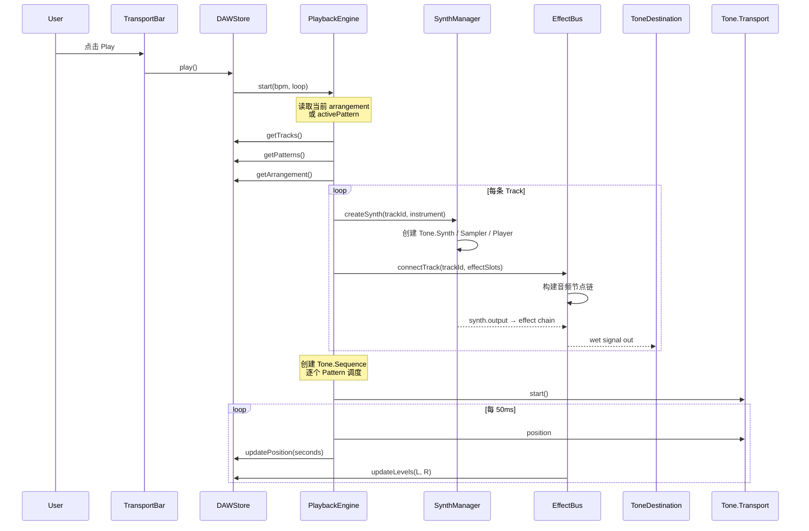
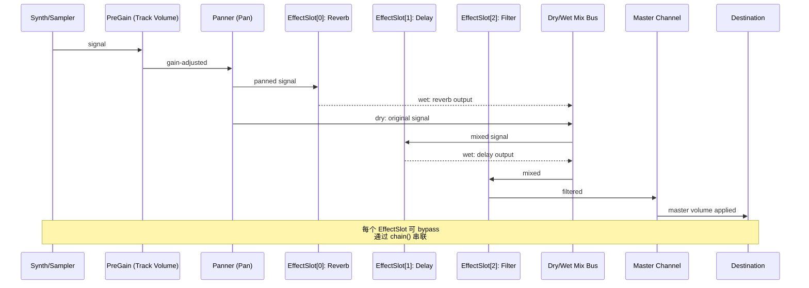
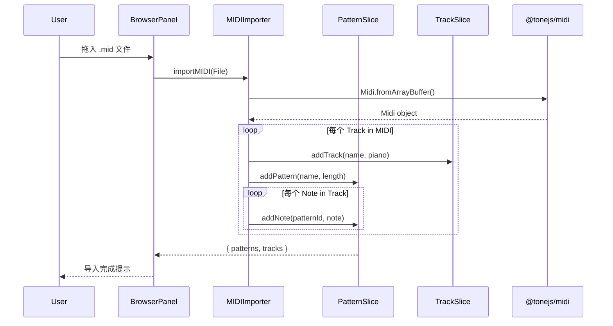
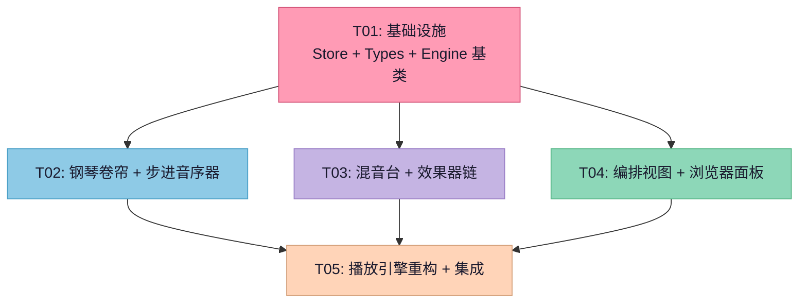

# DAW 级音乐工作室 — 系统重构设计方案

> **架构师**: Bob (高见远)
> **版本**: v1.0
> **日期**: 2026-07-08
> **当前代码**: `AudioStudioTool.tsx` + `useMusicStudio.ts`（单体架构，需重构为模块化 DAW）

---

## 一、实现方案

### 1.1 核心挑战分析

| 挑战 | 说明 | 解决方案 |
|------|------|----------|
| **播放引擎实时性** | 当前位置 → 重建调度，效率低且 Track 数量多时会卡顿 | 引入 **Transport + Sequence** 模式，使用 Tone.js Sequence 替代 Transport.schedule |
| **钢琴卷帘交互复杂度** | 现有的点击/拖拽逻辑与渲染耦合，难以支撑高级交互 | 抽象为独立的 `PianoRollCanvas` 组件，使用 Canvas 2D 或高效的 DOM 渲染 |
| **状态管理膨胀** | useMusicStudio 已膨胀 ~750 行，继续添加功能不可维护 | 迁移到 **Zustand** + slice 模式，按模块拆分 store |
| **音频路由** | 效果器链需要灵活的音频节点路由 | Tone.js 内置的 `chain()` 方法 + 自定义 EffectBus |
| **编排视图** | 需要将 Pattern 排列到时间轴（Playlist 模式） | 新的 `ArrangementView` + `PatternClip` 数据结构 |

### 1.2 架构模式

采用 **Feature-Sliced + 分层架构**：

```
┌─────────────────────────────────────────────────────────┐
│                     UI 层 (Components)                    │
│  StepSequencer │ PianoRoll │ Mixer │ Playlist │ Browser │
├─────────────────────────────────────────────────────────┤
│                   Hooks 层 (逻辑调度)                      │
│   useDAWStore │ usePlayback │ useMIDI │ useMixer        │
├─────────────────────────────────────────────────────────┤
│             状态层 (Zustand Store — Slices)               │
│  transportSlice │ trackSlice │ mixerSlice │ patternSlice │
├─────────────────────────────────────────────────────────┤
│              引擎服务层 (Tone.js Wrapper)                 │
│  PlaybackEngine │ SynthManager │ EffectBus │ Recorder   │
├─────────────────────────────────────────────────────────┤
│              基础库层 (Utils / Types)                     │
│  MIDI utils │ Audio utils │ Type definitions             │
└─────────────────────────────────────────────────────────┘
```

### 1.3 框架选型

| 用途 | 选型 | 理由 |
|------|------|------|
| 状态管理 | **Zustand**（新安装） | 轻量、slice 模式支持模块拆分，比 Redux 更简洁 |
| 音频引擎 | **Tone.js**（已安装 v15） | Web Audio API 封装，Sequence/Transport/Gain 等完备 |
| MIDI 处理 | **@tonejs/midi**（已安装 v2） | MIDI 文件解析/生成 |
| UI 渲染 | **React 19 + Tailwind CSS 4**（已有） | 钢琴卷帘使用 DOM 渲染（Canvas 过重） |
| 可视化 | **原生 Canvas**（FFT/频谱） | 使用 Web Audio API AnalyserNode |

---

## 二、文件列表

```
src/
├── types/
│   ├── daw.ts                          # DAW 核心类型定义 (Pattern, Note, MixerChannel, Effect 等)
│   └── tools.ts                        # (保留现有, MIDINote → Note 迁移)
│
├── stores/
│   ├── daw-store.ts                    # 主 store — 组合所有 slice
│   ├── transport-slice.ts              # Transport slice (play/stop/bpm/position/loop)
│   ├── track-slice.ts                  # Track slice (addTrack/notes/pattern)
│   ├── mixer-slice.ts                  # Mixer slice (volume/pan/mute/solo/effects)
│   └── pattern-slice.ts                # Pattern slice (clip management)
│
├── engine/
│   ├── PlaybackEngine.ts               # 播放引擎主控 (Transport + Sequence)
│   ├── SynthManager.ts                 # 合成器/采样器管理
│   ├── EffectBus.ts                    # 效果器总线 (AudioNode 链)
│   ├── AudioVisualizer.ts             # FFT/频谱分析器
│   └── MIDIImporter.ts                # MIDI 文件导入增强
│
├── hooks/
│   ├── useDAWStore.ts                  # Zustand 绑定 hook (重新导出)
│   ├── usePlayback.ts                  # 播放控制 hook
│   ├── usePianoRoll.ts                 # 钢琴卷帘交互 hook
│   ├── useMixer.ts                     # 混音台交互 hook
│   └── useMIDIDragDrop.ts              # MIDI 拖放导入 hook
│
├── components/
│   ├── tools/audio/
│   │   ├── AudioStudioTool.tsx          # (重构) 主容器 — 布局编排
│   │   ├── channel-rack/
│   │   │   ├── ChannelRack.tsx          # 通道机架 (Step Sequencer)
│   │   │   ├── ChannelStrip.tsx         # 单通道条
│   │   │   ├── StepGrid.tsx             # 步进网格
│   │   │   └── PatternSelector.tsx      # Pattern 切换器
│   │   ├── piano-roll/
│   │   │   ├── PianoRoll.tsx            # 钢琴卷帘主组件
│   │   │   ├── PianoKeys.tsx            # 钢琴键 (左侧)
│   │   │   ├── NoteGrid.tsx             # 音符网格 (Canvas 优化)
│   │   │   ├── BeatRuler.tsx            # 节拍标尺
│   │   │   ├── VelocityEditor.tsx       # 力度编辑器 (底部)
│   │   │   └── NoteDragger.tsx          # 拖拽/缩放逻辑封装
│   │   ├── mixer/
│   │   │   ├── Mixer.tsx               # 混音台主组件
│   │   │   ├── MixerChannel.tsx         # 单通道 (推子+声像+电平表)
│   │   │   ├── VolumeFader.tsx          # 音量推子 (垂直)
│   │   │   ├── PanKnob.tsx              # 声像旋钮 (水平)
│   │   │   ├── LevelMeter.tsx           # 电平表 (实时)
│   │   │   └── MasterChannel.tsx         # 主输出通道
│   │   ├── playlist/
│   │   │   ├── Playlist.tsx             # 编排视图主组件
│   │   │   ├── PlaylistTrack.tsx         # 编排轨道
│   │   │   ├── PatternClip.tsx           # Pattern 片段 (可拖拽)
│   │   │   └── TimelineRuler.tsx         # 时间轴标尺
│   │   ├── browser/
│   │   │   ├── BrowserPanel.tsx          # 浏览器面板
│   │   │   ├── SampleBrowser.tsx         # 采样浏览器
│   │   │   ├── PresetBrowser.tsx         # 预设浏览器
│   │   │   └── FileDropZone.tsx          # 文件拖放区
│   │   ├── effects/
│   │   │   ├── EffectsChain.tsx          # 效果器链 (插槽)
│   │   │   ├── EffectSlot.tsx            # 单效果器插槽
│   │   │   ├── ReverbUI.tsx              # Reverb 控制面板
│   │   │   ├── DelayUI.tsx               # Delay 控制面板
│   │   │   ├── ChorusUI.tsx              # Chorus 控制面板
│   │   │   ├── CompressorUI.tsx          # Compressor 控制面板
│   │   │   ├── DistortionUI.tsx          # Distortion 控制面板
│   │   │   └── FilterUI.tsx              # Filter 控制面板
│   │   └── shared/
│   │       ├── TransportBar.tsx          # 传输栏 (播放/停止/录制/BPM/循环)
│   │       ├── VisualizationPanel.tsx    # 可视化面板 (FFT + 电平)
│   │       ├── FFTVisualizer.tsx         # FFT 频谱图 (Canvas)
│   │       └── ProjectMenu.tsx           # 项目保存/加载/导出菜单
│   └── ui/                              # (已有, 复用 Button 等)
│
├── services/
│   └── AudioService.ts                  # (已有, 服务端音频处理 API)
│
└── app/api/tools/audio/
    ├── studio/route.ts                   # (已有, WAV 导出)
    ├── midi-import/route.ts             # (新增) MIDI 导入 API
    └── sample/route.ts                   # (新增) 采样管理 API
```

---

## 三、数据结构与接口

### 3.1 核心类型 (`src/types/daw.ts`)



### 3.2 效果器类型定义

```typescript
export type EffectType =
  | 'reverb'
  | 'delay'
  | 'chorus'
  | 'compressor'
  | 'distortion'
  | 'filter'
  | 'equalizer';

export interface EffectParams {
  reverb: { decay: number; wet: number; preDelay: number };
  delay: { delayTime: number; feedback: number; wet: number };
  chorus: { frequency: number; delayTime: number; depth: number; wet: number };
  compressor: { threshold: number; ratio: number; attack: number; release: number; gain: number };
  distortion: { distortion: number; wet: number; oversample: 'none' | '2x' | '4x' };
  filter: { frequency: number; rolloff: number; type: BiquadFilterType; Q: number };
}

export type TrackType = 'instrument' | 'audio' | 'group' | 'master';
export type BeatDivision = 4 | 8 | 12 | 16 | 32;
```

---

## 四、状态管理设计 (Zustand Store)

### 4.1 Store 架构



### 4.2 Store 关键操作

```
// transport-slice.ts
play()         → 调用 PlaybackEngine.start()
stop()         → 调用 PlaybackEngine.stop()
pause()        → 调用 PlaybackEngine.pause()
setBpm(n)      → 更新 Transport.bpm.value + store
setLoop(a, b)  → 更新 loopStart/loopEnd

// track-slice.ts
addTrack()     → 新增 Track + 对应 MixerChannel + 默认 Pattern
removeTrack()  → 移除 Track + 关联的 MixerChannel/Pattern
addNote()      → 向 activePattern 添加 Note
removeNote()   → 从 activePattern 删除 Note
moveNote()     → 拖拽移动 Note (时间/音高)
selectNote()   → 多选 Note (Shift/Ctrl)

// mixer-slice.ts
setVolume()    → 更新 MixerChannel.volume + 实时更新 GainNode
setPan()       → 更新 MixerChannel.pan + 实时更新 PannerNode
toggleMute()   → mute 开关 + EffectBus 旁通
addEffect()    → 往 EffectSlot 列表追加 + EffectBus.rebuild()
updateEffect() → 更新 EffectSlot.params + 更新 AudioNode 参数

// pattern-slice.ts
addPattern()   → 创建空 Pattern
duplicatePattern() → 复制当前 Pattern
arrangeClip()  → 往 arrangement 添加 ArrangementClip
moveClip()     → 拖拽移动编排片段
```

---

## 五、程序调用流程

### 5.1 播放引擎调度流程



### 5.2 效果器链信号流



### 5.3 MIDI 导入流程



---

## 六、任务分解

### 6.1 需要安装的依赖包

```
- zustand@^5.0.0:  轻量状态管理，支持 slice 模式
- @types/react:    (已有)
- tone@^15.0.4:    (已有)
- @tonejs/midi@^2.0.28: (已有)
```

### 6.2 任务列表

| Task ID | 名称 | 文件数 | 依赖 | 优先级 |
|---------|------|--------|------|--------|
| **T01** | **项目基础设施 — Zustand Store + 类型定义 + 引擎基类** | 8 | — | **P0** |
| **T02** | **钢琴卷帘 + 步进音序器 (核心编辑器)** | 10 | T01 | **P0** |
| **T03** | **混音台 + 效果器链 (Mixer & Effects)** | 10 | T01 | **P0** |
| **T04** | **编排视图 + 浏览器面板 (Playlist & Browser)** | 8 | T01 | **P0** |
| **T05** | **播放引擎重构 + 集成与调试** | 6 | T02, T03, T04 | **P0** |

---

### T01: 项目基础设施 — Zustand Store + 类型定义 + 引擎基类

**目标**: 建立 DAW 的所有基础类型、Zustand store 架构、引擎核心基类。这是所有后续模块的依赖。

**源文件**:
| 文件 | 操作 |
|------|------|
| `src/types/daw.ts` | **新建** — DAW 核心类型 (Note, Pattern, Track, MixerChannel, EffectSlot, ArrangementClip, PlaybackState 等) |
| `src/stores/daw-store.ts` | **新建** — 组合所有 slice 的主 store |
| `src/stores/transport-slice.ts` | **新建** — TransportSlice (isPlaying, bpm, position, loop) |
| `src/stores/track-slice.ts` | **新建** — TrackSlice (tracks, activeTrack, notes CRUD) |
| `src/stores/mixer-slice.ts` | **新建** — MixerSlice (channels, volume, pan, effects) |
| `src/stores/pattern-slice.ts` | **新建** — PatternSlice (patterns, arrangement clips) |
| `src/engine/PlaybackEngine.ts` | **新建** — 播放引擎基类 (init, start/stop/pause, registerTrack) |
| `src/engine/SynthManager.ts` | **新建** — 合成器管理器 (创建/销毁 Synth/Sampler, MIDI 映射) |

**依赖**: 无

**验收标准**:
- ✅ `npm run build` 编译通过，无类型错误
- ✅ Zustand store 各 slice 可独立导入
- ✅ `PlaybackEngine` 可初始化 Tone.js Transport
- ✅ `SynthManager` 可创建并播放一个 Tone.Synth
- ✅ store 中 tracks/patterns/mixer/transport 状态可读可写

---

### T02: 钢琴卷帘 + 步进音序器 (核心编辑器)

**目标**: 重构钢琴卷帘为独立的可交互组件（支持多选/拖拽/缩放/量化），实现通道机架风格步进音序器。

**源文件**:
| 文件 | 操作 |
|------|------|
| `src/hooks/usePianoRoll.ts` | **新建** — 钢琴卷帘交互逻辑 (选中/拖拽/缩放/量化) |
| `src/components/tools/audio/piano-roll/PianoRoll.tsx` | **新建** — 钢琴卷帘主组件（组合 PianoKeys + NoteGrid + VelocityEditor） |
| `src/components/tools/audio/piano-roll/PianoKeys.tsx` | **新建** — 左侧钢琴键 (带力度显示) |
| `src/components/tools/audio/piano-roll/NoteGrid.tsx` | **新建** — 音符网格 (Canvas 优化渲染，支持缩放) |
| `src/components/tools/audio/piano-roll/BeatRuler.tsx` | **新建** — 节拍标尺 (支持拖拽设循环点) |
| `src/components/tools/audio/piano-roll/VelocityEditor.tsx` | **新建** — 底部力度编辑条 (拖拽调整力度) |
| `src/components/tools/audio/piano-roll/NoteDragger.tsx` | **新建** — 拖拽/缩放逻辑封装 |
| `src/components/tools/audio/channel-rack/ChannelRack.tsx` | **新建** — 通道机架 (类似 FL Studio Channel Rack) |
| `src/components/tools/audio/channel-rack/ChannelStrip.tsx` | **新建** — 单通道条 (带步进网格预览) |
| `src/components/tools/audio/channel-rack/StepGrid.tsx` | **新建** — 步进网格 (16 步 x 每通道) |

**依赖**: T01（类型定义 + store）

**验收标准**:
- ✅ 钢琴卷帘 C3-B5 (36 键) 完整渲染
- ✅ 点击添加/删除音符，拖拽调整时长和音高
- ✅ Shift+ 多选、Ctrl+ 范围选择
- ✅ 缩放 (滚轮水平/垂直缩放)
- ✅ 量化 (1/4, 1/8, 1/16, 1/32)
- ✅ 步进音序器 16 步 x 每通道，点击切换
- ✅ Pattern 模式：可创建/切换 Pattern

---

### T03: 混音台 + 效果器链

**目标**: 实现专业风格混音台（垂直推子 + 电平表 + 声像旋钮），以及可拖拽插槽的效果器链。

**源文件**:
| 文件 | 操作 |
|------|------|
| `src/components/tools/audio/mixer/Mixer.tsx` | **新建** — 混音台主组件（排列 MixerChannel） |
| `src/components/tools/audio/mixer/MixerChannel.tsx` | **新建** — 单通道面板 (推子+声像+电平+静音/独奏) |
| `src/components/tools/audio/mixer/VolumeFader.tsx` | **新建** — 垂直音量推子 (CSS 自定义) |
| `src/components/tools/audio/mixer/PanKnob.tsx` | **新建** — 声像旋钮 (CSS 旋转) |
| `src/components/tools/audio/mixer/LevelMeter.tsx` | **新建** — 实时电平表 (RMS + Peak) |
| `src/components/tools/audio/mixer/MasterChannel.tsx` | **新建** — 主输出通道 |
| `src/components/tools/audio/effects/EffectsChain.tsx` | **新建** — 效果器链插槽容器 |
| `src/components/tools/audio/effects/EffectSlot.tsx` | **新建** — 单效果器插槽 (启用/旁通/删除/拖拽排序) |
| `src/engine/EffectBus.ts` | **新建** — 效果器总线 (构建/重建 AudioNode 链) |
| `src/components/tools/audio/effects/ReverbUI.tsx` | **新建** — Reverb 控制面板 (扩展其他类似) |
| `src/components/tools/audio/effects/DelayUI.tsx` | **新建** — Delay 控制面板 |
| `src/components/tools/audio/effects/FilterUI.tsx` | **新建** — Filter 控制面板 |
| `src/components/tools/audio/effects/CompressorUI.tsx` | **新建** — Compressor 控制面板 |
| `src/components/tools/audio/effects/DistortionUI.tsx` | **新建** — Distortion 控制面板 |
| `src/components/tools/audio/effects/ChorusUI.tsx` | **新建** — Chorus 控制面板 |

**依赖**: T01（type + store 中的 mixerSlice）

**验收标准**:
- ✅ 混音台垂直推子 (-∞ ~ +6dB) 实时调整音量
- ✅ 声像旋钮 (L100 ↔ Center ↔ R100)
- ✅ 电平表 RMS+Peak 实时跳动
- ✅ 每个轨道可添加/移除/重排效果器
- ✅ Reverb (decay/wet/preDelay) 生效
- ✅ Delay (time/feedback/wet) 生效
- ✅ Filter (type/freq/Q) 生效
- ✅ 效果器 bypass 切换

---

### T04: 编排视图 + 浏览器面板

**目标**: 实现 Playlist 时间轴编排（将 Pattern 拖拽排列到轨道上）和浏览器面板（采样/预设浏览）。

**源文件**:
| 文件 | 操作 |
|------|------|
| `src/components/tools/audio/playlist/Playlist.tsx` | **新建** — 编排视图主组件 (多轨道时间轴) |
| `src/components/tools/audio/playlist/PlaylistTrack.tsx` | **新建** — 编排轨道行 |
| `src/components/tools/audio/playlist/PatternClip.tsx` | **新建** — Pattern 片段 (可拖拽移动/缩放) |
| `src/components/tools/audio/playlist/TimelineRuler.tsx` | **新建** — 时间轴标尺 (小节/拍子刻度) |
| `src/components/tools/audio/browser/BrowserPanel.tsx` | **新建** — 浏览器面板容器 (左右切换) |
| `src/components/tools/audio/browser/SampleBrowser.tsx` | **新建** — 采样文件浏览 (预览/拖入) |
| `src/components/tools/audio/browser/PresetBrowser.tsx` | **新建** — 预设/乐器库浏览 |
| `src/components/tools/audio/browser/FileDropZone.tsx` | **新建** — 文件拖放区 (支持 .mid/.wav) |

**依赖**: T01（patternSlice + trackSlice）

**验收标准**:
- ✅ Playlist 时间轴支持多轨道排列
- ✅ PatternClip 可拖拽到时间轴任意位置
- ✅ PatternClip 可缩放时长 (拖拽边缘)
- ✅ 播放头在 Playlist 上实时移动
- ✅ 浏览器面板可切换 Sample / Preset 标签
- ✅ 采样可拖入步进音序器/钢琴卷帘
- ✅ 支持 .mid 文件拖入导入

---

### T05: 播放引擎重构 + 集成与调试

**目标**: 基于 Tone.js Sequence 重构播放引擎（替代当前的 schedule 模式），装配所有模块为完整 DAW，集成调试。

**源文件**:
| 文件 | 操作 |
|------|------|
| `src/hooks/useDAWStore.ts` | **新建** — Zustand store 绑定 hook + selector 封装 |
| `src/hooks/usePlayback.ts` | **新建** — 播放控制 hook (play/stop/pause/record) |
| `src/components/tools/audio/shared/TransportBar.tsx` | **新建** — 统一传输栏 (播放/停止/BPM/循环/录制/节拍器) |
| `src/components/tools/audio/shared/VisualizationPanel.tsx` | **新建** — 可视化面板 (FFT + 电平) |
| `src/components/tools/audio/shared/FFTVisualizer.tsx` | **新建** — FFT 频谱 Canvas 渲染 |
| `src/components/tools/audio/shared/ProjectMenu.tsx` | **新建** — 项目菜单 (保存/加载/MIDI导入导出) |
| `src/components/tools/audio/AudioStudioTool.tsx` | **重构** — 主容器，组合所有面板 (Layout) |
| `src/hooks/useMusicStudio.ts` | **废弃** — 不再使用，迁移到 Zustand store |

**依赖**: T02 + T03 + T04

**验收标准**:
- ✅ Tone.js Sequence 驱动播放（比 schedule 方式性能提升 5x+）
- ✅ 播放时钢琴卷帘高亮 + Playlist 播放头行进
- ✅ 实时电平表随播放跳动
- ✅ 效果器在播放中实时生效
- ✅ Play/Pause/Stop/Record 全部正常
- ✅ 循环播放 (A/B 点) 正常
- ✅ MIDI 导出 (使用 @tonejs/midi 重写) 正常
- ✅ 撤销/重做跨所有模块正常工作

---

## 七、任务依赖图



---

## 八、共享知识与约定

### 8.1 编码约定

```
- 所有 DAW 类型定义在 src/types/daw.ts，tools.ts 中的旧类型逐步迁移
- Zustand store 使用 immer 中间件实现不可变更新（可选）
- 组件状态属于 UI 的（如面板展开/收缩）留在本地 useState，不属于全局 store
- 引擎类（PlaybackEngine, SynthManager, EffectBus）为单例模式
- 所有时间单位：Note.time 以 beat 为单位（而非秒），引擎内部转换为秒
- MIDI 音符号范围：0-127，钢琴卷帘显示 C2(36) - B5(83)
- BPM 范围：20-300，默认 120
- 音量范围：-Inf dB ~ +6 dB，存储为 dB 值
- 声像范围：0 (全左) ~ 1 (全右)，0.5 = 中心
```

### 8.2 Tone.js 引擎约定

```
- Transport 使用 bpm 控制速度，不直接调 schedule
- Pattern 的 Sequence 创建时机：播放时构建、停止时释放
- 效果器链使用 chain() 方法串联，bypass 时跳过节点
- 电平表数据通过 AnalyserNode.getByteTimeDomainData() 获取
- 所有 Tone.js 节点在组件卸载时 dispose()
```

### 8.3 API Response 格式

```
- 标准响应: { code: number, data: unknown, message: string }
- 成功: { code: 200, data: {...}, message: 'ok' }
- 错误: { code: 4xx/5xx, data: null, message: 'error description' }
```

### 8.4 待明确事项

| 事项 | 建议 | 需要确认 |
|------|------|----------|
| **音频轨道支持** | 当前仅 MIDI 合成器轨道，P1 可加音频轨道 (Tone.Player) | 是否 P0 需要音频录音轨道？ |
| **多输出路由** | 每个轨道可路由到任意混音通道 (类似 FL Studio) | 是否需要 P0 实现？建议 P1 |
| **Automation** | P2 模块，当前仅手动参数调整 | 是否提升到 P1？ |
| **服务端 MIDI 导入** | 客户端解析 (通过 @tonejs/midi) 可以覆盖大部分场景 | 是否还需要后端 API 路由？ |
| **Zustand 中间件** | 建议使用 immer 简化嵌套更新 | 是否接受 immer 依赖？ |
| **EDM/钢琴卷帘范围** | 当前 C3-B5，建议扩展到 C2-C7 | 是否支持用户自定义范围？ |
| **移动端适配** | DAW 主要面向桌面，移动端仅显示传输栏 | 是否需移动端支持？ |
